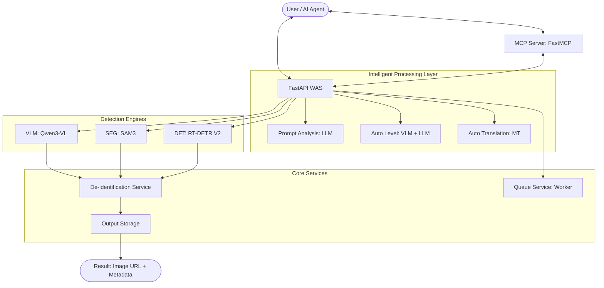

# 🛡️ Intelligent De-identification Agent (GEMINI)

[](https://fastapi.tiangolo.com/)
[](https://modelcontextprotocol.io/)
[](https://www.python.org/downloads/)
[](https://opensource.org/licenses/MIT)

**GEMINI** is a high-performance, intelligent image de-identification system that combines state-of-the-art computer vision (VLM, Segmentation, Detection) with LLM-based reasoning to protect privacy in visual data.

---

## 🌟 Key Features

### 🔍 Multi-Algorithm Detection Engines
- **VLM (Vision-Language Model)**: Deep understanding of natural language prompts using **Qwen3-VL-8B-Thinking**.
- **Segmentation**: Pixel-perfect precision with **SAM3 (Segment Anything Model 3)**.
- **Object Detection**: High-speed real-time processing with **RT-DETR V2**.

### 🧠 Intelligent Analysis (Auto-Decision)
- **Auto Level (Scene Awareness)**: Automatically assigns de-identification strength (1-10) by analyzing scene sensitivity using LLMs (GPT-4o or Local Ollama).
- **Prompt Analysis**: Automatically maps vague user requests (e.g., "hide the background") to technical parameters like `category`, `target`, and `method`.
- **Auto Translation**: Seamlessly handles Korean prompts by translating them to English via **MT-ko-en** to maximize AI recognition accuracy.

### 🎭 Flexible De-identification Options
- **Targeting**: Choose between `inner` (hide the object) or `outer` (hide everything *except* the object).
- **Shapes**: Supports `bbox` (rectangles), `circle`, `ellipse`, and `polygon` (for segmentation).
- **Methods**: High-quality **Gaussian Blur**, **Pixelation (Subsampling)**, or a combination of both.

### ⚡ Production-Ready Infrastructure
- **Async Queue System**: Background processing for high-load environments with status tracking.
- **MCP Integration**: Fully compatible with **Model Context Protocol**, allowing AI agents like Claude to use these tools directly.
- **Auto-Cleanup**: Automatic expiration and deletion of processed images to ensure data privacy.

---

## 🏗️ Architecture



---

## 🛠️ Installation & Setup

### 1. Prerequisites
- Python 3.10 or higher
- CUDA-enabled GPU (Highly recommended for VLM/SAM3)
- [Ollama](https://ollama.ai/) (Optional, for local LLM support)

### 2. Clone and Install
```bash
git clone https://github.com/your-repo/de-identification-agent.git
cd de-identification-agent

# Install dependencies for WAS
pip install -r requirements_was.txt

# Install dependencies for MCP
pip install -r requirements_mcp.txt
```

### 3. Configuration
Copy the `.env.example` (if provided) or create a `.env` file in the root directory.
```dotenv
# Algorithm Configuration
ALGORITHM_CATEGORY="VLM | SEGMENTATION"
PROMPT_ANALYSIS_ON=yes

# LLM Configuration
LLM_PROVIDER=ollama # or openai
OLLAMA_BASE_URL=http://localhost:11434
LLM_MODEL_NAME=gpt-oss:20b

# Storage
OUTPUT_EXPIRY_MINUTES=30
```

---

## 🚀 Running the System

### Start the Processing WAS (Backend)
```bash
./scripts/start_was.sh
```

### Start the MCP Server (For Agent Interaction)
```bash
./scripts/start_mcp.sh
```

---

## 🧪 Usage Examples

### 1. Synchronous API Request
```bash
curl -X POST "http://localhost:8020/api/v1/deidentify/" \
  -H "X-API-Key: your-secret-api-key" \
  -F "image=@my_photo.jpg" \
  -F "prompt=person with red hat" \
  -F "category=SEGMENTATION" \
  -F "target=inner"
```

### 2. Asynchronous Queue (For Batch Processing)
```bash
# Enqueue the job
curl -X POST "http://localhost:8020/api/v1/deidentify/enqueue" \
  -F "image=@bulk_photo.jpg" \
  -F "prompt=license plate"

# Check status
curl "http://localhost:8020/api/v1/deidentify/status/{job_id}"
```

### 3. Integrated CLI Test
```bash
python was/test/test_deidentify.py --image photo.jpg --prompt "배경만 가려줘"
```

---

## 📂 Project Structure

- `was/`: Core FastAPI application and business logic.
  - `routers/`: API endpoint definitions (Health, De-identify).
  - `services/`: Specialized logic for Detection, Segmentation, VLM, and De-identification.
  - `utils/`: Image processing, translation, and security helpers.
- `mcp_app/`: Model Context Protocol server implementation.
- `scripts/`: Deployment and maintenance scripts.
- `inputs/` / `outputs/`: Temporary storage for processing (auto-cleaned).

---

## 📜 License
This project is licensed under the MIT License. See the [LICENSE](LICENSE) file for details.

---
*For detailed technical specifications and expansion guides, please refer to [GEMINI.md](./GEMINI.md).*
